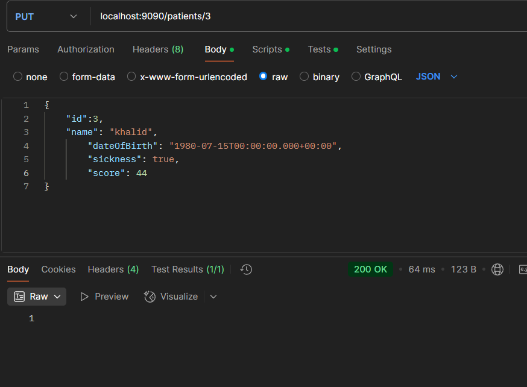

# Patient Management System
## A simple Java application for managing patients using CRUD operations.

### Features
Add new patients
Retrieve patient details
Update patient information
Delete patients
### Technologies Used:
Java
Spring Boot
H2
### Setup
#### Clone the repository:
``` git clone https://github.com/mreckah/Spring_hospital_management ```
#### Configure the database in ``` application.properties. ```
#### Run the application using:
``` mvn spring-boot:run ```
### API Endpoints
POST /patients → Add a new patient

GET /patients/{id} → Get patient by ID


PUT /patients/{id} → Update patient details


DELETE /patients/{id} → Remove a patient


### License
This project is open-source. Feel free to use and modify it.

